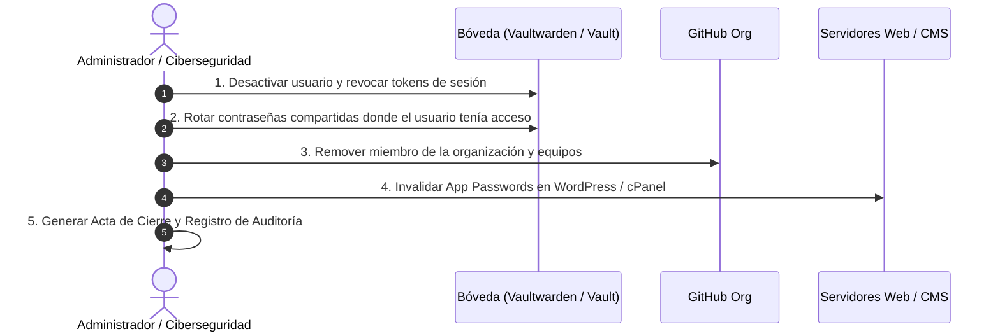

# SOP-05: Protocolo de Desprovisionamiento Oportuno de Accesos (Offboarding)

* **Proyecto:** DevSecOps NIST CSF v2.0
* **Empresa:** Alma Industria Creativa E.I.R.L.
* **Control NIST CSF v2.0:** RC.RP-01 (Recovery Plan Execution) / PR.AA-05 (Access Revocation)
* **Fase PHVA:** Actuar (Act)

---

## 1. Objetivo
Garantizar la revocación inmediata, total e irreversible de credenciales, tokens de API y accesos a servidores de cualquier colaborador, practicante o proveedor externo que finalice su vínculo laboral o contractual con la empresa.

---

## 2. Flujo de Ejecución del Desprovisionamiento

---

## 3. Checklist Operativo de Revocación (Tiempo Máximo: 15 Minutos)

- [ ] **Vault / Vaultwarden:**
  1. Ingresar a la consola administrativa de Vaultwarden.
  2. Deshabilitar/Eliminar la cuenta del usuario saliente.
  3. Ejecutar rotación de credenciales en las carpetas de la organización a las que tuvo acceso.
- [ ] **GitHub / Repositorios:**
  1. Eliminar al colaborador del repositorio y de la organización en GitHub.
  2. Revocar llaves SSH y tokens de acceso personal vinculados al colaborador.
- [ ] **WordPress / CMS:**
  1. Cambiar estado de usuario a inactivo o eliminar reasignando contenido a cuenta institucional.
  2. Revocar *Application Passwords* asociadas a la cuenta.
- [ ] **Servidores / SSH:**
  1. Eliminar la clave pública del colaborador de `~/.ssh/authorized_keys` en los servidores remotos.
  2. Reiniciar sesiones activas: `pkill -u <username>`.

---

## 4. Registro y Evidencia de Cumplimiento
Toda acción de offboarding debe quedar registrada en la bitácora central con:
* Fecha y hora exacta de la solicitud.
* Fecha y hora exacta de la revocación total.
* Nombre del responsable técnico que ejecutó el procedimiento.
* Tiempo total transcurrido (Métrica objetivo: $< 15$ minutos).
