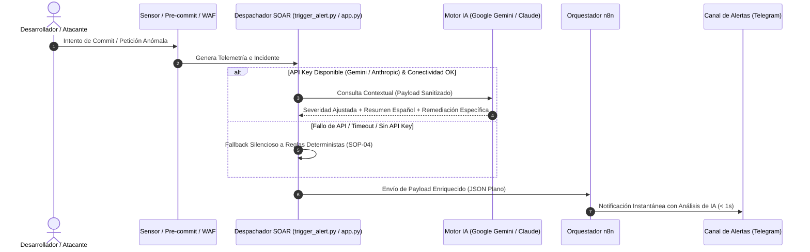

# SOP-07: Procedimiento de Triage Inteligente Asistido por IA

* **Proyecto:** Implementación de un Sistema de DevSecOps mediante el ciclo PHVA y framework NIST CSF v2.0
* **Empresa:** Alma Industria Creativa E.I.R.L.
* **Control NIST CSF v2.0:** **RS.AN-01** (Incident Analysis) / **DE.AE-01** (Anomaly Detection)
* **Fase PHVA:** Verificar (*Check*) y Responder (*Act*)
* **Autores:** Sergio Saul Incacutipa Mamani & Waldir Rivaldo Chullo Chuma

---

## 1. Objetivo
Estandarizar y automatizar el análisis contextual de incidentes de seguridad en tiempo real mediante Modelos de Lenguaje de Gran Escala (LLM - **Google Gemini 2.5 Flash** / **Anthropic Claude**), proporcionando al equipo de SOC y desarrollo:
1. Una reevaluación contextual de la severidad del evento.
2. Un resumen ejecutivo del incidente en lenguaje natural (español).
3. Acciones de remediación técnicas específicas, priorizadas y accionables, reduciendo la carga cognitiva del analista y acelerando el MTTR.

---

## 2. Flujo de Triage Asistido por IA y Mecanismo de Fallback

---

## 3. Especificación Técnica de los Campos Enriquecidos

| Campo Generado | Origen | Descripción | Ejemplo |
| :--- | :--- | :--- | :--- |
| `ai_summary` | Modelo LLM | Resumen analítico de 2 a 3 frases en español describiendo causa raíz e impacto. | *"Se interceptó un intento de subida de tokens de bot y claves AWS en staging. La filtración expondría la infraestructura cloud a accesos no autorizados."* |
| `suggested_action` | Modelo LLM | Pasos técnicos específicos y numerados para mitigar la amenaza de inmediato. | *"1. Revocar de inmediato la clave AWS en IAM. 2. Custodiar el nuevo secreto en Vaultwarden. 3. Ejecutar git reset en la rama local."* |
| `triage_source` | Sistema | Indicador de trazabilidad que audita si la respuesta proviene de IA o del Fallback local. | `"Triage IA Asistido (Google gemini-2.5-flash)"`, `"Triage IA Asistido (Anthropic claude-sonnet-4-6)"` o `"Reglas Deterministas SOP-04 (Fallback Local)"` |

---

## 4. Política de Privacidad y Protección de Datos (DLP)
Para cumplir con la **Ley N° 29733 (Ley de Protección de Datos Personales del Perú)** y las directivas de seguridad de la información de Alma Industria Creativa E.I.R.L.:
1. **Redacción de Credenciales:** Los valores sensibles reales (contraseñas, tokens JWT, keys) son ofuscados o redactados (`REDACTED`) antes de interactuar con modelos externos.
2. **Sanitización de Salida:** Las respuestas de la IA se limpian automáticamente de caracteres especiales (`<`, `>`) para garantizar compatibilidad estricta con el bot de Telegram y prevenir inyecciones.
3. **Resiliencia Operativa:** La indisponibilidad de la API de IA **nunca** debe bloquear la emisión de la alerta hacia el orquestador SOAR (tiempo de timeout estricto: $\le 5$ segundos).

---

## 5. Métrica de Impacto en el MTTR
* **Tiempo de Triage Manual Tradicional:** $20 \text{ a } 60 \text{ minutos}$.
* **Tiempo de Triage Asistido por IA (SOAR):** $< 2 \text{ segundos}$ ($1,200 \text{ a } 1,800 \text{ ms}$).
* **Efectividad:** Reducción superior al $95\%$ en la etapa de análisis inicial (*Incident Analysis - RS.AN-01*).
