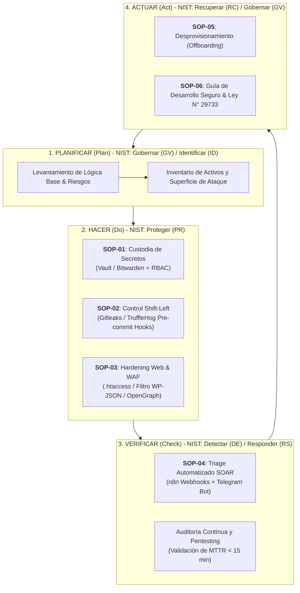

# DevSecOps NIST CSF v2.0 - Alma Industria Creativa E.I.R.L.

[](https://github.com/Kroosand/devsecops-alma-nist/actions/workflows/devsecops-pipeline.yml)

Repositorio de implementación técnica para el Proyecto de Titulación Profesional Técnico en **SENATI** (Dirección Zonal Arequipa - Puno / Escuela de Tecnologías de la Información / Ingeniería de Ciberseguridad).

## 📌 Datos del Proyecto
* **Título:** *Implementación de un Sistema de DevSecOps mediante el ciclo PHVA y framework NIST CSF v2.0 en la Empresa Alma Industria Creativa E.I.R.L.*
* **Autores:** 
  * Sergio Saul Incacutipa Mamani
  * Waldir Rivaldo Chullo Chuma
* **Asesor:** César Francisco Rivera Portugal
* **Empresa:** Alma Industria Creativa E.I.R.L. (Área Growth y Desarrollo Web)

---

## 🏛️ Mapeo de Arquitectura Técnica y Metodología (PHVA + NIST CSF v2.0)



---

## 📂 Estructura del Repositorio

```text
├── 01-shift-left/               # [SOP-02] Detección temprana de secretos en Git
│   ├── hooks/                   # Hooks pre-commit (Bash y PowerShell)
│   ├── .gitleaks.toml           # Reglas personalizadas de detección
│   └── tests/                   # Pruebas con Canary Tokens
│
├── 02-hardening-web/            # [SOP-03] Bastionado perimetral y reglas WAF
│   ├── .htaccess                # Cabeceras HTTP, filtro WP-JSON y OpenGraph whitelist
│   ├── nginx-litespeed.conf     # Directivas equivalentes para Nginx / LiteSpeed
│   └── wp-hardening-plugin.php  # Plugin de seguridad para CMS WordPress
│
├── 03-secrets-management/       # [SOP-01 & SOP-05] Gestión centralizada de secretos
│   ├── docker-compose.yml       # Entorno de laboratorio (Vaultwarden + Apps)
│   ├── rbac-policies/           # Políticas de acceso por roles de desarrollo
│   └── offboarding-protocol.md  # Procedimiento de revocación de accesos
│
├── 04-soar-n8n-testing/         # [SOP-04] Orquestación de respuesta a incidentes
│   ├── trigger_alert.py         # Emisor de eventos hacia Webhooks de n8n
│   ├── test_wp_enumeration.py   # Script de auditoría de endpoints expuestos
│   └── mttr_benchmark.py        # Medición comparativa del tiempo de respuesta
│
└── 05-docs-senati/              # [SOP-06] Documentación técnica y gobernanza
    ├── MATRIZ_NIST_CSF_v2.0.md  # Mapeo formal de controles NIST
    └── GUIA_DESARROLLO_SEGURO.md # Estándar de desarrollo y cumplimiento Ley 29733
```

---

## 🚀 Inicio Rápido (Quickstart)

### 1. Activar el Pre-commit Hook en tu entorno local:
```powershell
# En Windows (PowerShell):
Set-ExecutionPolicy -Scope Process -ExecutionPolicy Bypass
.\01-shift-left\hooks\install_hooks.ps1
```
```bash
# En Linux / macOS / Git Bash:
chmod +x ./01-shift-left/hooks/install_hooks.sh
./01-shift-left/hooks/install_hooks.sh
```

### 2. Validar el bloqueo de credenciales:
```powershell
python .\01-shift-left\tests\test_canary_secrets.py
```
